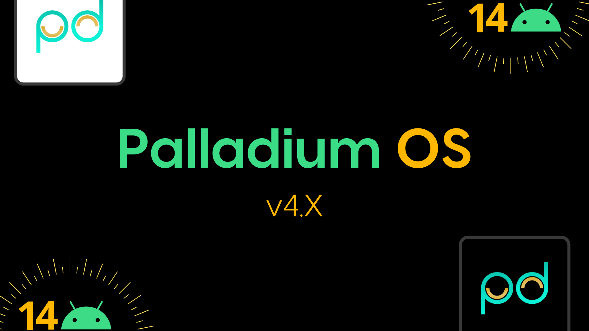

---------------------------------------------------------------------------------------
Palladium OS
===========

To get started with Palladium-OS, you'll need to get familiar with [Repo](https://source.android.com/source/using-repo.html) and Version Control with [Git](https://source.android.com/source/version-control.html).


To initialize your local repository, run this command:
------------------------------------------------------

```bash
repo init -u git@github.com:Palladium-u/platform_manifest.git -b 14
```

Afterwards, sync the source by running this command:
----------------

```bash
repo sync -c --force-sync --optimized-fetch --no-tags --no-clone-bundle --prune -j$(nproc --all)
```


Building Palladium OS
---------------
In order to build, use this command:
```bash
. build/env*
lunch palladium_<devicecodename>-userdebug
make palladium -j$(nproc --all)
```

---------------------------------------------------------------------------------------
 Credits:
 =======

 * [**LineageOS**](https://github.com/LineageOS)
